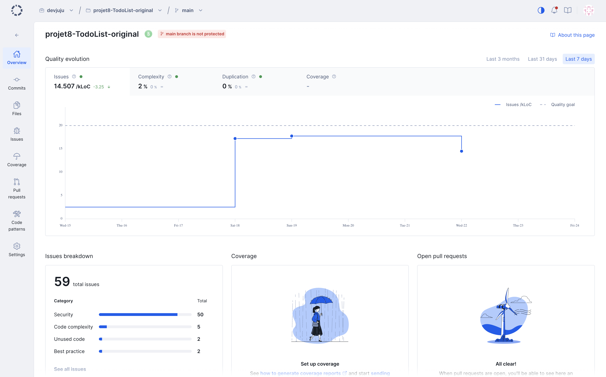

# Audit initial – ToDo & Co

## 🎯 Objectif

Ce document présente l'état du projet avant les améliorations réalisées dans le cadre du projet OpenClassrooms.

L'objectif est d'identifier les principaux problèmes de qualité, de sécurité, de maintenance et de performance afin de définir les travaux à réaliser.

L'application originale a d'abord été remise en fonctionnement dans un environnement Docker afin de disposer d'une base stable. Les audits présentés dans ce document portent ensuite sur cette version fonctionnelle du projet, avant toute amélioration du code métier.

---

## Environnement

Le projet est basé sur les technologies suivantes :

| Élément      | État du projet original              |
| ------------ | ------------------------------------ |
| Framework    | Symfony 3.1.10                       |
| PHP cible    | PHP 5.5.9 à 7.x                      |
| Architecture | Symfony Standard Edition             |
| ORM          | Doctrine ORM 2.6                     |
| Tests        | PHPUnit présent mais peu exploité    |
| Docker       | Non présent dans le projet d'origine |

Afin de pouvoir exécuter l'application dans un environnement moderne et reproductible, un environnement Docker a été mis en place avant la réalisation des audits.

Cette conteneurisation ne modifie pas le code applicatif ; elle permet uniquement d'assurer le fonctionnement de l'application sur une machine actuelle.

---

## Analyse de la qualité du code

L'analyse initiale du projet a été réalisée avec Codacy avant les améliorations.

La capture d'écran de l'analyse est disponible dans le dossier `docs/audit/codacy.png`.

### Résultat Codacy

| Indicateur    | Valeur         |
| ------------- | -------------- |
| Grade global  | **B**          |
| Issues        | **59**         |
| Issues / kLoC | **14.507**     |
| Complexité    | **2 %**        |
| Duplication   | **0 %**        |
| Couverture    | Non configurée |

---

## Répartition des problèmes

Les 59 problèmes détectés se répartissent principalement comme suit :

| Catégorie       | Nombre |
| --------------- | ------ |
| Security        | 50     |
| Code complexity | 5      |
| Unused code     | 2      |
| Best practices  | 2      |

## Observations

L'analyse met en évidence plusieurs points positifs :

- faible complexité du code ;
- aucune duplication détectée ;
- architecture globale cohérente.

En revanche, plusieurs faiblesses apparaissent :

- nombreuses alertes de sécurité ;
- absence de couverture de code ;
- dépendances anciennes ;
- dette technique importante.

## Interprétation

Le projet reste relativement simple à maintenir grâce à sa faible complexité et à l'absence de duplication.

En revanche, la quantité importante d'alertes de sécurité et l'ancienneté des dépendances montrent que le projet nécessite une remise à niveau avant toute évolution importante.

L'absence de tests automatisés constitue également un risque lors des futures modifications.

---

## Dette technique

### 📦 Dépendances

Le projet repose sur Symfony 3.1 et plusieurs bibliothèques aujourd'hui obsolètes.

Conséquences :

- nombreuses dépendances abandonnées ;
- incompatibilités avec les versions récentes de PHP ;
- exposition à des vulnérabilités connues.

---

### Compatibilité

L'application n'est plus directement exécutable sur un environnement moderne sans adaptation.

Conséquences :

- installation difficile ;
- incompatibilités avec Composer récent ;
- nécessité d'une migration progressive.

---

### Fonctionnalités

Plusieurs exigences du cahier des charges ne sont pas respectées.

Par exemple :

- une tâche n'est pas automatiquement rattachée à son auteur ;
- le rôle utilisateur ne peut pas être choisi depuis l'interface - d'administration ;
- certaines règles de suppression ne sont pas appliquées.

---

### Sécurité

Les contrôles d'accès restent incomplets.

Exemples :

- accès administrateur insuffisamment protégé ;
- suppression de tâches ne respectant pas les règles métier.

### Tests

Constats :

- très peu de tests présents ;
- couverture de code inexistante ;
- aucune validation automatique des fonctionnalités demandées.

---

## Conclusion

L'analyse initiale montre que le projet est fonctionnel mais présente une dette technique importante.

Les principaux travaux identifiés sont :

- migration de Symfony vers une version LTS ;
- modernisation de l'environnement de développement ;
- mise en conformité des fonctionnalités avec le cahier des charges ;
- renforcement des contrôles d'accès ;
- mise en place d'une stratégie de tests automatisés ;
- amélioration de la documentation technique.
